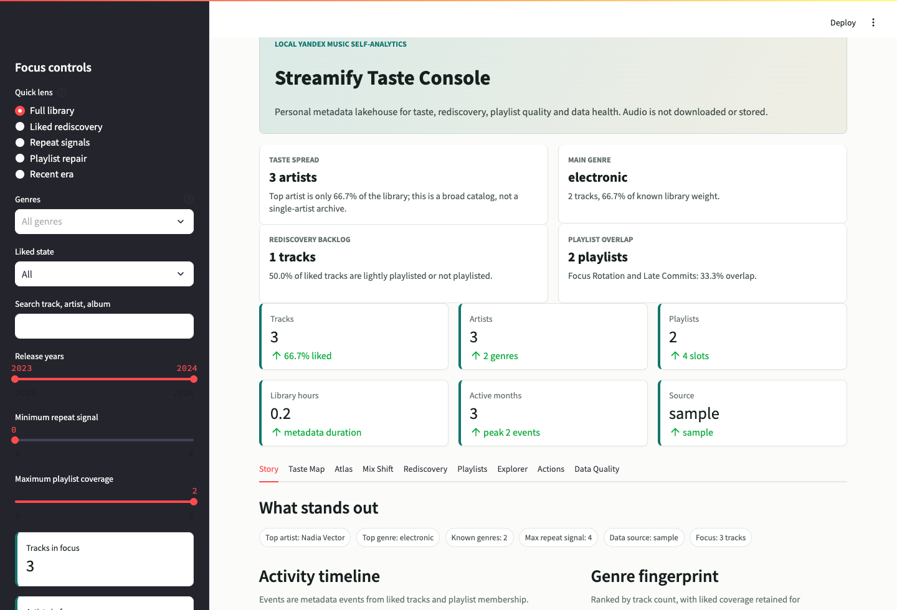
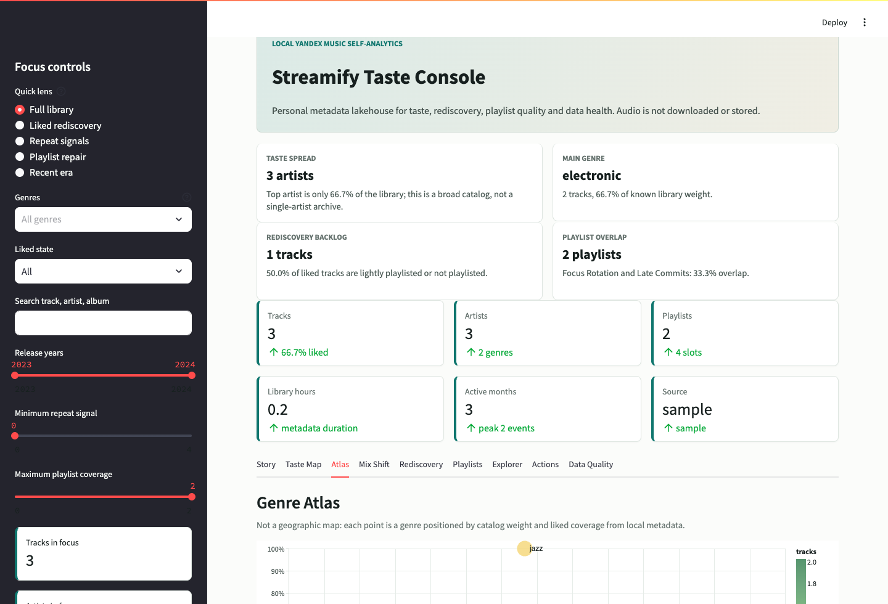
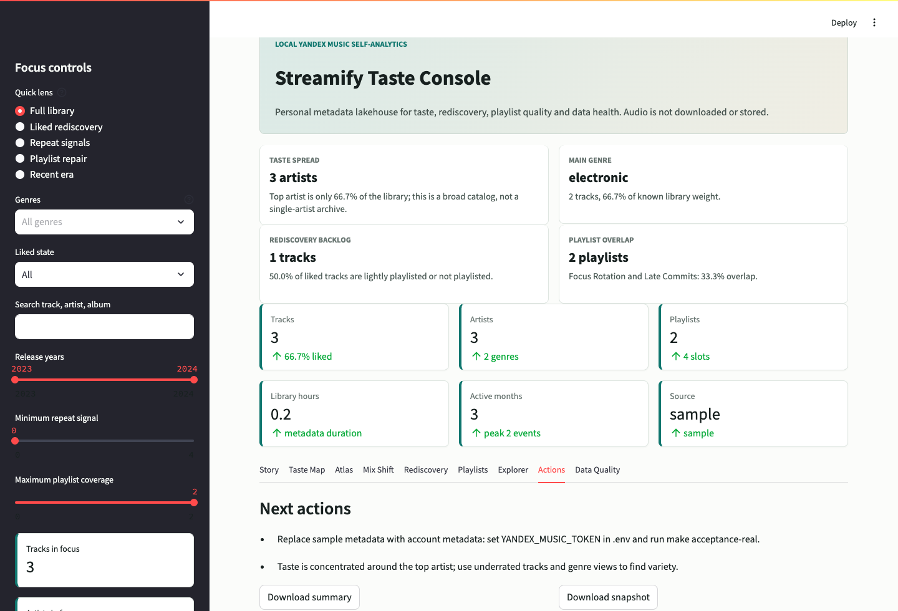

# Streamify

**Личная аналитика Яндекс Музыки, которая живет на вашем ноутбуке.**

Streamify забирает только метаданные вашей музыкальной библиотеки, складывает их в локальный DuckDB lakehouse и превращает в понятный дашборд: любимые артисты, жанровые сдвиги, пересечения плейлистов, треки для rediscovery, качество данных и готовность к будущим картам.

Аудио не скачивается, не хранится и не воспроизводится. Токен остается в локальном `.env`, а приватные raw-данные, DuckDB-файлы, snapshots и рекомендации не попадают в git.



## Что дает продукт

- Видно, какие артисты, треки и жанры реально доминируют.
- Можно понять, как меняется вкус по месяцам, эпохам релизов и жанровым периодам.
- Есть очереди действий: что переслушать, какие плейлисты почистить, какие находки не потерять.
- Есть инженерный контур: raw JSONL, DuckDB/dbt, lineage, quality gates, JSON snapshot и CSV exports.
- Есть честный geo-контракт: Streamify не выдумывает местоположение, а готовит слой для явных enrichment-файлов.

## Дашборд

Интерфейс не сводится к таблицам. Основные экраны: `Story`, `Taste Map`, `Atlas`, `Mix Shift`, `Rediscovery`, `Playlists`, `Explorer`, `Actions`, `Data Quality`.





## Быстрый запуск

Sample-режим без токена:

```bash
cp .env.example .env
make setup
make acceptance-local
make dashboard
```

После запуска откройте URL, который напечатает `make dashboard`.

Режим с вашей Яндекс Музыкой:

```bash
cp .env.example .env
make token-help
# Добавьте YANDEX_MUSIC_TOKEN в .env.
make acceptance-real
make dashboard
```

`make acceptance-real` требует, чтобы последний manifest доказывал `source=yandex_music`. Docker Compose использует профиль `local`; `.env.example` задает `DBT_THREADS=1`, а команды запускаются через `scripts/run_with_dotenv.py`, чтобы Makefile не парсил секреты.

## Команды

```bash
make help                 # карта команд
make status               # безопасная диагностика без вывода токена
make ingest-sample        # детерминированные sample-данные
make ingest               # ingestion метаданных реального аккаунта
make raw-contract         # проверка raw JSONL и manifest
make dbt-build            # DuckDB/dbt-марты
make report               # Markdown-отчет
make snapshot             # data/streamify_snapshot.json
make recommendations      # data/recommendations/*.csv
make dashboard            # Streamlit dashboard
make pages-site           # GitHub Pages сайт в public/
make up-local             # Docker Compose local profile
make compose-smoke-real   # smoke с реальным токеном
make readiness-real       # проверка source=yandex_music
make clean-local          # очистка локальных артефактов
make test                 # полный локальный gate
```

## Архитектура

```text
Метаданные Яндекс Музыки
  -> yamusic_ingest raw JSONL
  -> dbt staging views
  -> DuckDB marts
  -> Streamlit dashboard, report, snapshot, recommendation queues
```

Локальные артефакты:

- `data/raw/yamusic/*.jsonl`
- `data/streamify.duckdb`
- `data/streamify_summary.md`
- `data/streamify_snapshot.json`
- `data/recommendations/*.csv`
- `data/enrichment/*.csv`

`make clean-local` удаляет raw data, отчеты, DuckDB-файлы и dbt `target`/`logs`/`dbt_packages`, но не трогает `.env`.

Ключевые марты:

- `yamusic_dim_tracks`, `yamusic_dim_artists`, `yamusic_dim_albums`, `yamusic_dim_playlists`
- `yamusic_fact_library_events`, `yamusic_fact_playlist_tracks`
- `yamusic_artist_affinity`, `yamusic_genre_profile`, `yamusic_genre_periods`
- `yamusic_track_signals`, `yamusic_playlist_signals`, `yamusic_playlist_overlap`
- `yamusic_library_profile`

Lineage описан в [docs/yamusic_lineage.md](docs/yamusic_lineage.md).

## География и карты

Метаданные Яндекс Музыки не содержат надежную геолокацию прослушивания. Streamify не считает регион аккаунта, язык плейлиста, жанр или происхождение артиста вашим местоположением.

Будущие карты требуют явных локальных enrichment-файлов:

- `artist_locations.csv` — места, связанные с артистами;
- `user_location_events.csv` — пользовательская timeline геолокации.

Контракт описан в [docs/location_enrichment.md](docs/location_enrichment.md).

## GitHub Pages

`make pages-site` собирает русскоязычную продуктовую документацию в `public/`. Pages строятся на sample metadata с пустым `YANDEX_MUSIC_TOKEN`, поэтому публичный сайт воспроизводим и не зависит от приватного аккаунта.

На сайте есть overview, runbook, демонстрации dashboard, Atlas + geo, lineage, acceptance matrix, release process и sample summary.

## Проверки качества

`make test` проверяет:

- контракт репозитория;
- защиту от секретов и аудио-артефактов;
- dbt smoke для пустого/закрытого аккаунта;
- sample acceptance flow;
- smoke для продуктовых ответов;
- smoke для real-account gate;
- сборку Pages;
- Python compile checks;
- pytest;
- Docker Compose config и local profile smoke.

## Документация

- [Локальный runbook](docs/yandex_music_local.md)
- [Lineage данных](docs/yamusic_lineage.md)
- [Приемка продукта](docs/product_acceptance.md)
- [Контракт гео-обогащения](docs/location_enrichment.md)
- [Управление проектом](docs/project_management.md)
- [Процесс релиза](docs/release_process.md)
