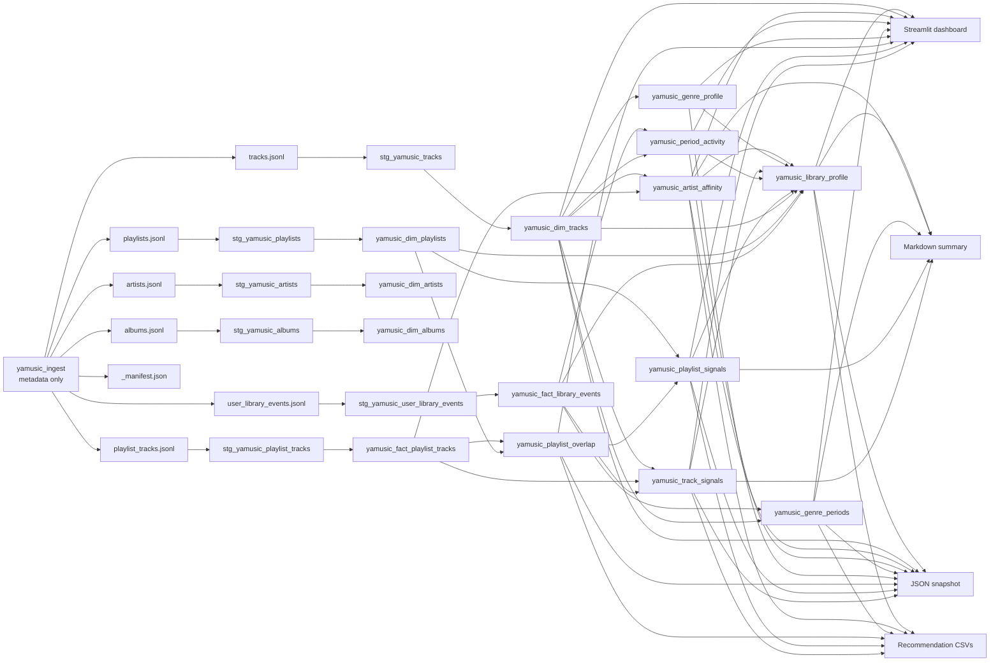

# Yandex Music Local Lineage

This catalog documents the local metadata-only data path. Streamify does not download, store, transform, or play audio.

## Layer Map

| Layer | Artifact | Purpose |
| --- | --- | --- |
| Raw/Bronze | `data/raw/yamusic/tracks.jsonl` | Track metadata, album fields, artist arrays, liked flag, source and ingestion timestamp. |
| Raw/Bronze | `data/raw/yamusic/artists.jsonl` | Artist metadata discovered from tracks and account-visible liked artists. |
| Raw/Bronze | `data/raw/yamusic/albums.jsonl` | Album metadata discovered from tracks and account-visible liked albums. |
| Raw/Bronze | `data/raw/yamusic/playlists.jsonl` | Owned playlist metadata plus account-visible liked playlists and declared track counts where exposed by Yandex Music. |
| Raw/Bronze | `data/raw/yamusic/playlist_tracks.jsonl` | Playlist-track membership and positions. |
| Raw/Bronze | `data/raw/yamusic/user_library_events.jsonl` | Derived metadata events for liked tracks and playlist membership. |
| Raw/Bronze | `data/raw/yamusic/_manifest.json` | Source, generated timestamp, adapter/client metadata, diagnostics counters, output paths, row counts and JSONL checksums. It must not contain token material. |
| Silver | `stg_yamusic_manifest` | Parsed ingestion manifest with source, generated timestamp, JSON-only flag, adapter/client metadata, diagnostics counters and raw row counts. |
| Silver | `stg_yamusic_*` | Typed DuckDB reads, dedupe, null normalization and relationship-ready keys. |
| Gold | `yamusic_dim_*`, `yamusic_fact_*`, `yamusic_*_profile`, `yamusic_*_signals` | Practical marts for self-analytics and dashboard views. |
| App | `dashboard/app.py` | Streamlit interface over `data/streamify.duckdb`. |
| Report | `data/streamify_summary.md` | Static answer-first self-analytics summary exported from the same DuckDB marts. |
| Snapshot | `data/streamify_snapshot.json` | Schema-versioned JSON self-analytics snapshot for automation, CI artifacts and downstream agent workflows. |
| Recommendations | `data/recommendations/*.csv` | Spreadsheet-friendly action queues for rediscovery, playlist cleanup, standout playlists, top artists and genre shifts. |

## Lineage

## Product Questions

| Product question | Primary model | Supporting models |
| --- | --- | --- |
| Favorite artists | `yamusic_artist_affinity` | `yamusic_dim_tracks`, `yamusic_fact_playlist_tracks` |
| Favorite tracks | `yamusic_dim_tracks` | `yamusic_track_signals` |
| Genre shifts | `yamusic_genre_periods` | `yamusic_period_activity`, `yamusic_genre_profile` |
| Repeats | `yamusic_track_signals.repeat_signal` | `yamusic_fact_library_events`, `yamusic_fact_playlist_tracks` |
| Diversity | `yamusic_genre_profile`, `yamusic_library_profile` | `yamusic_artist_affinity` |
| Active periods | `yamusic_period_activity` | `yamusic_fact_library_events` |
| Underrated tracks | `yamusic_track_signals.underrated_flag` | `yamusic_dim_tracks` |
| Underrated playlists | `yamusic_playlist_signals.underrated_playlist_flag` | `yamusic_playlist_overlap`, `yamusic_dim_playlists` |
| Data freshness | `yamusic_library_profile.stale_ingestion_flag` | `yamusic_fact_library_events` |

## Quality Gates

| Gate | Command | What it proves |
| --- | --- | --- |
| Raw contract | `make raw-contract` | Required raw JSONL fields, basic types, source values, event types, manifest row counts, JSONL sha256 checksums, ingestion diagnostics consistency, unique IDs and playlist/event referential integrity. |
| dbt build | `make dbt-build` | dbt packages resolve, then DuckDB marts compile, build and pass schema/relationship tests. |
| Local doctor | `make doctor` | Required raw files, manifest, mart tables and one-row profile exist, with DuckDB manifest source/raw counts matching the latest raw files. |
| Dashboard smoke | `make dashboard-smoke` | Streamlit starts against the local DuckDB file and returns HTTP 200. |
| Report export | `make report` | Static markdown summary and JSON snapshot can be generated from the local DuckDB marts. |
| Snapshot export | `make snapshot` | Schema-versioned JSON self-analytics snapshot can be generated independently for automation and agent workflows. |
| Recommendations export | `make recommendations` | Spreadsheet-friendly CSV queues can be generated independently for top artists, rediscovery tracks, playlist cleanup, standout playlists and genre shifts. |
| Product answers | `make product-answers-smoke` | Favorite artists/tracks, repeats, genre shifts, diversity, active periods, playlist overlap, underrated signals, source provenance and data-quality profile are queryable from marts/report/snapshot. |
| Readiness audit | `make readiness` | Current raw counts, DuckDB profile, report existence, no-audio invariant, sample-vs-real source status and stale-dbt protection are verified. |
| Compose smoke | `make compose-smoke-local` | Docker Compose `local` profile builds, ingests sample metadata, validates raw contract, builds marts, runs doctor, exports the report, runs readiness, and serves dashboard HTTP 200. |
| Full local gate | `make test` | Static validators, safety guards, empty-account smoke, sample acceptance, Python tests and Docker Compose smoke. |
| Real account gate | `make acceptance-real` | Real token preflight, real metadata ingestion, raw contract, dbt deps/build, doctor, report, `readiness-real` source enforcement and dashboard smoke. |
